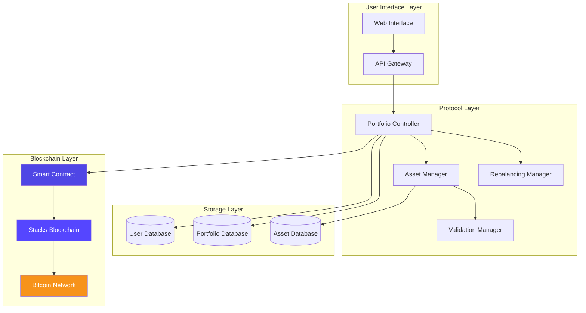
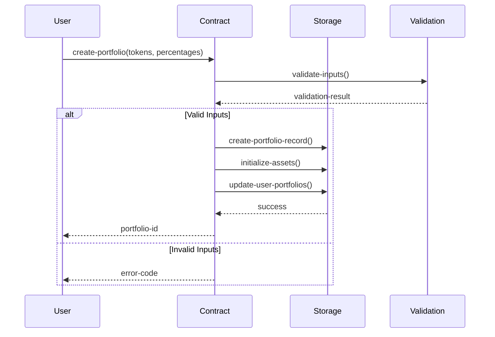
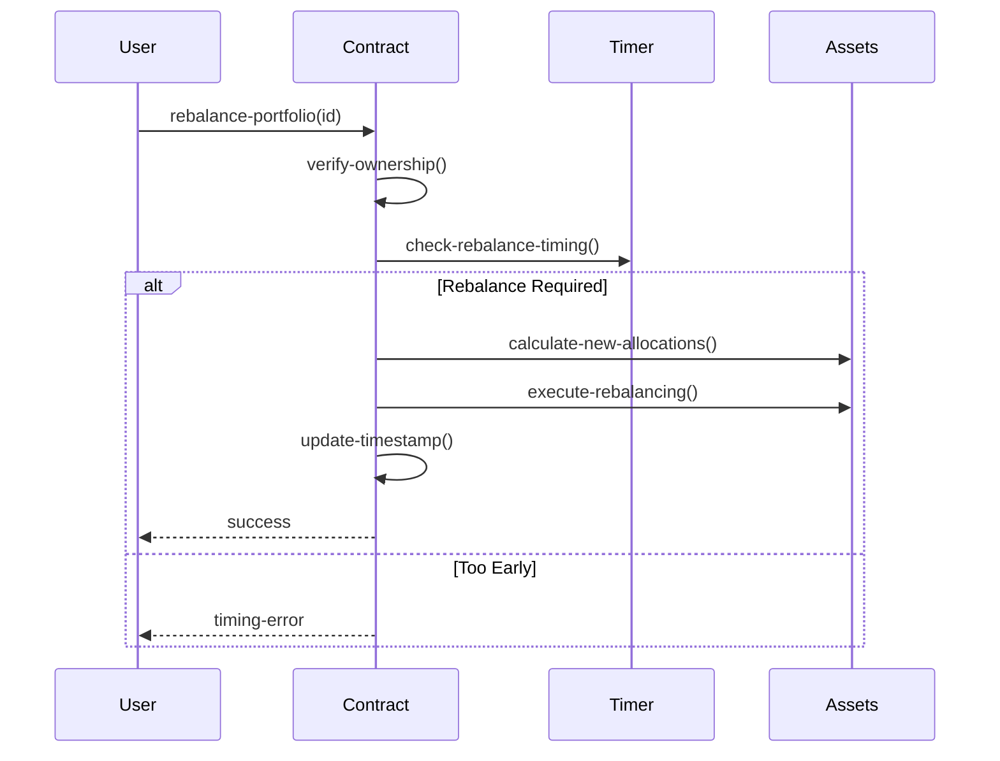

# BitVault Pro - Intelligent Asset Orchestration Protocol

[](https://stacks.co)
[](https://bitcoin.org)

> Next-generation decentralized portfolio management with automated rebalancing and intelligent asset allocation strategies built for Bitcoin Layer 2 ecosystems.

## 🚀 Overview

BitVault Pro revolutionizes decentralized finance by providing institutional-grade portfolio management tools directly on the Stacks blockchain. This protocol enables users to create sophisticated investment strategies with automated rebalancing, risk management, and multi-asset allocation, combining Bitcoin's security with smart contract flexibility.

### Key Features

- 📊 **Multi-Asset Portfolios**: Support for up to 10 tokens per portfolio
- ⚡ **Automated Rebalancing**: Time-based rebalancing with 24-hour intervals
- 🔒 **Granular Permissions**: Owner-based access control and portfolio management
- 💎 **Real-time Valuation**: Dynamic portfolio tracking and performance metrics
- ⛽ **Gas Optimized**: Minimal transaction costs with efficient operations
- 🛡️ **Bitcoin Security**: Leveraging Bitcoin's security through Stacks Layer 2

## 🏗️ System Architecture



## 🔧 Contract Architecture

### Core Components

#### 1. **Portfolio Management Core**

- `Portfolios` map: Stores portfolio metadata and configuration
- `PortfolioAssets` map: Manages individual asset allocations
- `UserPortfolios` map: Tracks user ownership relationships

#### 2. **Asset Orchestration Engine**

- Multi-token support with configurable allocations
- Percentage-based allocation system (basis points)
- Dynamic rebalancing triggers

#### 3. **Security & Validation Layer**

- Owner-based authorization system
- Input validation for all parameters
- Error handling with descriptive error codes

### Data Structures

```clarity
;; Portfolio Metadata
{
    owner: principal,
    created-at: uint,
    last-rebalanced: uint,
    total-value: uint,
    active: bool,
    token-count: uint
}

;; Asset Configuration
{
    target-percentage: uint,
    current-amount: uint,
    token-address: principal
}
```

## 📊 Data Flow

### Portfolio Creation Flow



### Rebalancing Flow



## 🚀 Quick Start

### Prerequisites

- Stacks wallet (Leather, Xverse, or similar)
- STX tokens for transaction fees
- Supported tokens for portfolio creation

### Basic Usage

1. **Create Portfolio**

```clarity
(contract-call? .bitvault-pro create-portfolio 
    (list 'SP1H1733V5MZ3SZ9XRW9FKYGEZT0JDGEB8Y634C7R.token-a
          'SP1H1733V5MZ3SZ9XRW9FKYGEZT0JDGEB8Y634C7R.token-b)
    (list u5000 u5000)) ;; 50% each
```

2. **Rebalance Portfolio**

```clarity
(contract-call? .bitvault-pro rebalance-portfolio u1)
```

3. **Update Allocation**

```clarity
(contract-call? .bitvault-pro update-portfolio-allocation u1 u0 u6000) ;; 60%
```

## 📋 API Reference

### Read-Only Functions

| Function | Parameters | Returns | Description |
|----------|------------|---------|-------------|
| `get-portfolio` | `portfolio-id: uint` | `Portfolio` | Retrieve portfolio details |
| `get-portfolio-asset` | `portfolio-id: uint, token-id: uint` | `Asset` | Get asset configuration |
| `get-user-portfolios` | `user: principal` | `(list uint)` | List user's portfolios |
| `calculate-rebalance-amounts` | `portfolio-id: uint` | `RebalanceInfo` | Check rebalancing needs |

### Public Functions

| Function | Parameters | Access | Description |
|----------|------------|--------|-------------|
| `create-portfolio` | `tokens: (list principal), percentages: (list uint)` | Public | Create new portfolio |
| `rebalance-portfolio` | `portfolio-id: uint` | Owner Only | Execute rebalancing |
| `update-portfolio-allocation` | `portfolio-id: uint, token-id: uint, percentage: uint` | Owner Only | Modify allocations |

## 🛡️ Security Features

- **Owner-based Access Control**: Only portfolio owners can modify their portfolios
- **Input Validation**: Comprehensive validation for all parameters
- **Percentage Constraints**: Ensures allocations stay within valid ranges
- **Token Limits**: Maximum 10 tokens per portfolio for gas efficiency
- **Rebalancing Cooldown**: 24-hour minimum between rebalances

## 🔍 Error Codes

| Code | Description |
|------|-------------|
| `u100` | Not authorized |
| `u101` | Invalid portfolio |
| `u102` | Insufficient balance |
| `u103` | Invalid token |
| `u104` | Rebalance failed |
| `u105` | Portfolio already exists |
| `u106` | Invalid percentage |
| `u107` | Maximum tokens exceeded |
| `u108` | Length mismatch |
| `u109` | User storage failed |
| `u110` | Invalid token ID |

## 🎯 Use Cases

### Individual Investors

- **Dollar-Cost Averaging**: Automated periodic rebalancing
- **Risk Management**: Diversified multi-asset portfolios
- **Passive Management**: Set-and-forget investment strategies

### Institutional Users

- **Treasury Management**: Corporate treasury diversification
- **Fund Management**: Automated fund rebalancing
- **Risk Hedging**: Multi-token risk distribution

### DeFi Protocols

- **Liquidity Management**: Optimized liquidity allocation
- **Treasury Optimization**: Protocol treasury management
- **Yield Farming**: Automated yield optimization strategies

## 📈 Benefits

### For Users

- **Professional Tools**: Institutional-grade portfolio management
- **Cost Efficiency**: Reduced gas costs through optimization
- **Accessibility**: User-friendly interface for complex strategies
- **Security**: Bitcoin-level security through Stacks

### For Ecosystem

- **Innovation**: Advanced DeFi primitives on Bitcoin Layer 2
- **Liquidity**: Increased token liquidity through rebalancing
- **Adoption**: Easier onboarding for traditional investors
- **Growth**: Enhanced utility for Stacks ecosystem tokens

## 🤝 Contributing

We welcome contributions! Please see our [Contributing Guidelines](CONTRIBUTING.md) for details.

### Built with ❤️ on Stacks • Secured by Bitcoin
